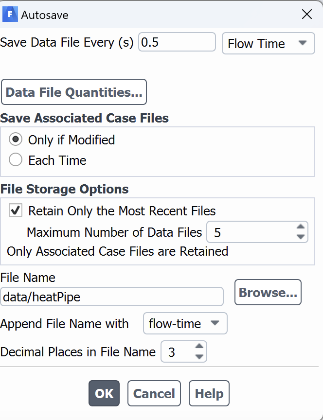

## Availability

```python exec="on"
import pandas as pd

df = pd.read_csv('docs/assets/tables/module.csv')
soft = df.query('Software == "fluent" | Software == "ANSYS"')
print(soft.to_markdown(index=False))
```
## Application Information, Documentation
To use Fluent on cluster, Users need to prepare the case using ANSYS on their local machine first. Please [download](https://njit.instructure.com/courses/8519/assignments/128626) ANSYS and follow the [instructions](https://ist.njit.edu/ansys-installation-instructions) to install ANSYS on your local machine.

## Using Fluent
To use Fluent in cluster, users first need to prepare the fluent case (meshing, setting boundary conditions) on their local machine  and save the case and data in `.cas` and `.dat` format respectively. 
If you are running transient problem and want to save the data at particular timestep or time interval, please see the steps below.

* Go to `Calculation Activities` option in the left pane and double-click the `Autosave (Every  Flow Time)` option, you will notice a separate dialogue box `Autosave`, where you need to specify how frequently you want to save the data, you can choose eiter `timestep` or `Flow Time` interval. In the `File name` option you need to specify the subdirectory where you want to save the data and the case name. In the example shown below the subdirectory is `data` and the problem name is heatpipe. You need to make sure to create the subdirectoy (`data` in this example) in the cluster where you want to intend to submit the job script.

   { width=30% height=30%}

   This is required if your job is somehow cancelled, or you need to restart from specific flow time.

* If you want  to ppstprocess the data using a different software , e.g. [Tecplot](tecplot.md) or [ParaView](paraview.md), you need to save the data in different file format at certain flow time or time step interval.  To set up the postprocessing configuration, select `File --> Export --> During Calculation --> Solution Data` option (see the figure below)
   
   { width=80% height=80%}

* Once you open the configuration, you will notice separate dialogue box `Automatic Export`. You need the file format in `File Type` option. Select the drop-down option to see different options. In this example above, `ensight` format has been selected. In right pane, you need to select which parameters you want to visualize. In the example above, `Volume Fraction` for different phases have been selected. 
* Next, you to select the file name and the subdirectory on cluster where you intend to write the post processed data. In this example, we choose to write the files in `ensi` subdirectory. Please make sure to create this subdirectory inside case directory on cluster before running the simulation. 
* You can also set how often you want to write your data. You need to select `Export Data Everty (s)` option in terms of time step interval or flow time interval.  
* Once you set up your case and initialize the problem, you need to go to `File --> write --> case and data` option to write the case and data in `.cas` and `.dat` respectively. 
* Transfer the `.cas` and `.dat` files to the cluster. See the [steps to transfer the data](cluster_access.md#transfer-the-data-from-the-local-machine-to-clusters-or-vice-versa) for transferring the files from local machine to cluster.
* Once you transfer the files, log on the cluster and go the directory where you transferred the `.cas` and `.dat` files. 
* Create a journal file which defines the input data file and some additional settings required by Fluent.  You can use the following journal file

??? example "Sample journal file : journal.JOU"
    
    ```bash
       /file/set-tui-version "21.1"
       /file/read-case-data tube_vof.cas.h5
       solve/dual-time-iterate 20 50
       (print-case-timer)
       parallel/timer/usage
    ```
In the above `Journal` script, the full name of case file (`tube_vof.cas.h5`) is mentioned. You need to modify based on the case file based on the problem.  The `solve/dual-time-iterate` specifies the end flow time and number of iterations. In the above example, `20` is the end flow time while the maximum number of iterations are `50`. The "dual-time" approach allows for a larger time step size by introducing an additional iteration loop within each time step. Users can select different approach based on their problems and need to modify it accordingly. 
For more details on journal commands, see the Fluent text user interface (TUI) commands from [Fluent documentation](../../assets/Ansys_Fluent_Text_Command_List.pdf).

??? example "Sample Batch Script to Run FLUENT : fluent.submit.sh"

    ```slurm
    #!/bin/bash -l
    #SBATCH --job-name=fluent
    #SBATCH --output=%x.%j.out # i%x.%j expands to slurm JobName.JobID
    #SBATCH --ntasks=8
    # Use "sinfo" to see what partitions are available to you
    #SBATCH --partition=public
    
    # Memory required; lower amount gets scheduling priority
    #SBATCH --mem-per-cpu=5G
    
    # Time required in d-hh:mm:ss format; lower time gets scheduling priority
    #SBATCH --time=5-24:59:00
    
    # Purge and load the correct modules
    module purge > /dev/null 2>&1
    module load ANSYS
    
    # Run the mpi program
    
    machines=hosts.$SLURM_JOB_ID
    touch $machines
    for node in `scontrol show hostnames`
        do
            echo "$node"  >> $machines
        done
    
    fluent 3ddp -affinity=off -ssh -t$SLURM_NTASKS -pib -mpi=intel -cnf="$machines" -g -i journal.JOU
    ```
Submit the job using `sbatch fluent.submit.sh` command. 

!!! warning
        
        Please note that the above SLURM script is for Lochness only. You need to modify slurm script for Wulver based on [SLURM](slurm.md).

## Related Applications

* [OpenFOAM](openfoam.md)

## User Contributed Information

!!! info "Please help us improve this page"
        Users are invited to contribute helpful information and corrections
        through our [Github repository](https://github.com/arcs-njit-edu/Docs/blob/main/CONTRIBUTING.md).


