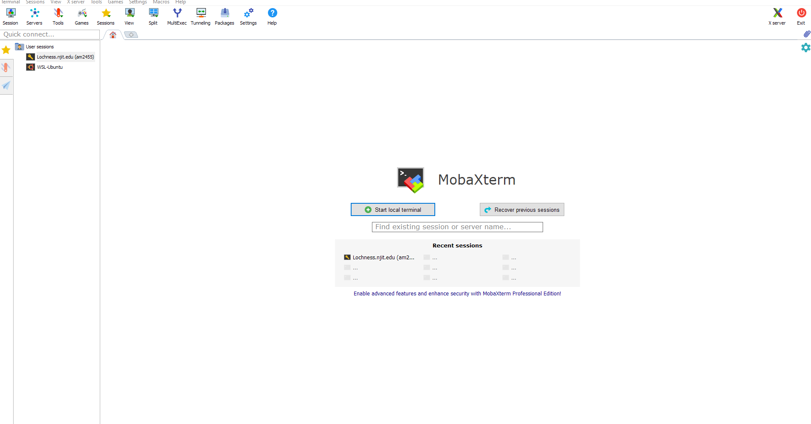
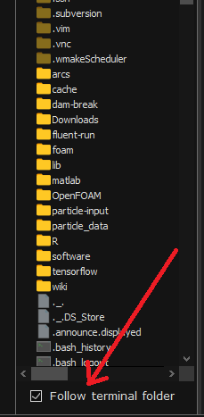
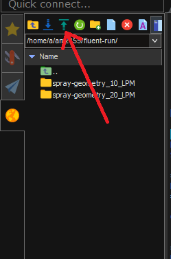

# Access to Wulver
Wulver is a new cluster which will be onlne on July 15th, 2023. To see the specifications of Wulver cluster please see the [Wulver Documentation](wulver.md). 
## Login to Wulver
If you already have access to existing clusters such as Lochness, you can login to Wulver by 
`ssh ucid@login01.tartan.njit.edu`. Replace `ucid` with your UCID. If you don't have prior access to NJIT cluster, you need to request for access.
Faculty can obtain a login to NJIT's HPC & BD systems by sending an email to [hpc@njit.edu](mailto:hpc@njit.edu). Students can obtain a login either by taking a class that uses one of the systems or by asking their faculty adviser to [contact](mailto:hpc@njit.edu) on their behalf. Your login and password are the same as for any NJIT AFS system.
Please see the documentation on [cluser access](cluster_access.md) for details.
## General Linux Commands

Make sure the user is connected to `NJITsecure` if the user is on campus. If working off campus, NJIT VPN is required. Please find the details [here](https://ist.njit.edu/vpn).
Here we will provide instructions on getting started with NJIT HPC for the user who uses Windows OS.

### Windows Users
Download the MobaXterm from this [link](https://ist.njit.edu/software-available-download/). 
Open MobaXterm after installation is completed. 
Select <kbd>Start local terminal</kbd> to open the terminal.



Type `ssh ucid@HPC_HOST.njit.edu`. Replace `ucid` with NJIT UCID. Substitute `lochness` or `Stheno` for `HPC_HOST`.

. 

User will be prompted to type the password. The password is NJIT UCID password.
After successful login, user will see the following in the terminal, which means the user is now connected to HPC.

```
Last login: Tue Oct 25 12:37:31 2022 from 10.192.228.138
Starting /home/a/user/.bash_profile ... standard AFS bash profile

========================
Home directory : /home/u/user is not in AFS -- skipping quota check
========================

On host login-1 :
         12:38:05 up 315 days, 22:36, 35 users,  load average: 10.32, 10.10, 10.63

=== === === Your Kerberos ticket and AFS token status === === ===
Kerberos :  Renew until 10/26/22 12:38:01, Flags: FRIA Renew until 10/26/22 12:38:01, Flags: FRA
AFS      :  User's (AFS ID 105631) tokens for afs@cad.njit.edu [Expires Oct 25 22:38]

Running your /home/u/user/.modules file:

To see your aliases, enter "alias"

login-1-41 ~ >:
```

### Mac OS/ Linux Users

Open terminal from <kbd>Launchpad</kbd> and select <kbd>terminal</kbd>.
Type the following in the terminal  
```
  localhost> ssh -X -Y ucid@HPC_HOST.njit.edu  
```
If you don’t yet have a public SSH key for your local machine, you need to initialize one. The process of doing so differs across operating systems. The Linux and Mac system users simply need to run the command `ssh-keygen`, which will store the keys in the `~/.ssh` folder.

Users will be prompted for your password. Enter your AFS password. Users can omit the `-X -Y` if you are not using a graphic interface. Substitute `lochness` or `Stheno` for `HPC_HOST`.
Once the password is provided the user will see the following

```
The authenticity of host 'user@lochness.njit.edu' cannot be established.
 DSA key fingerprint is 01:23:45:67:89:ab:cd:ef:ff:fe:dc:ba:98:76:54:32:10. 
 Are you sure you want to continue connecting (yes/no)?
```
  
Answering `yes` to the prompt will cause the session to continue. Once the host key has been stored in the known_hosts file, the client system can connect directly to that server again without the need for any approvals. 

## Passwordless Authentication to the NJIT Cluster
### Mac OS/ Linux Users
To access to NJIT cluster without the password, you need to have public ssh key on you Mac or Linux system. If you don’t yet have a public SSH key for your local machine, you need to initialize one. The process of doing so differs across operating systems. The Linux and Mac system users simply need to run the command `ssh-keygen`, which will store the keys in the `~/.ssh` folder. The public key is typically `id_rsa.pub` which is located in `~/.ssh/`.
Once you have a public SSH key, copy it to the set of authorized keys on the computing cluster. Since you’ve already connected to the cluster in the previous step, simply navigate to the `/.ssh` folder on the computing cluster and open the file `~/.ssh/authorized_keys` and paste the content of your public key from your local machine. Double-check that the pasted key begins with `ssh-rsa`.
### Windows Users
Windows users can save the public key through MobaXterm settings.

## Transfer the Data from the Local Machine to Clusters or vice versa 
### Windows Users
User needs to select the `follow terminal folder` of the left pane of the MobaXterm terminal. 



Next, to transfer the data from the local machine to Lochness user needs to select the `Upload to current folder` option, as shown below. Selecting this option will open a dialogue box where user needs to select the files to upload.



For transferring the data from Lochness to the local machine user needs to select the directory or the data from the left pane and then select `Download selected files`.

### Mac OS/Linux Users
User can also use the command in the terminal to transfer in and out the data 
 
```
rsync -avzP /path/to/local/machine ucid@HPC_HOST.njit.edu:/path/to/destination
```
Replace `HPC_HOST` with `lochness` or `Stheno`. This will transfer the data from the ocal machine to HPC cluster. 
To transfer the data from HPC cluster to local machine use
  
```
rsync -avzP ucid@HPC_HOST.njit.edu:/path/to/source /path/to/local/machine
```


